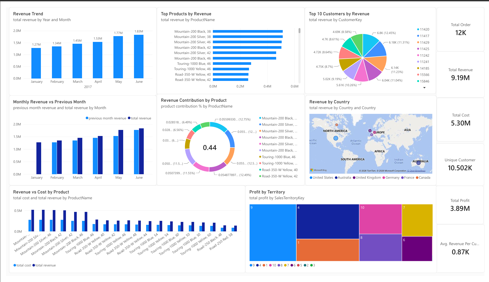
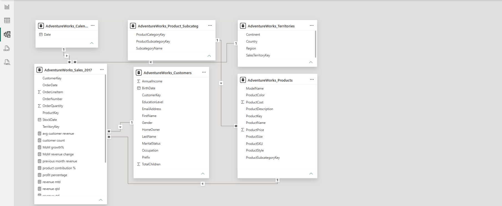

# 📊 AdventureWorks Sales Performance Dashboard (Power BI)

An interactive Power BI dashboard that analyses **2017 sales performance** for the AdventureWorks dataset — covering revenue, cost, profit, products, customers and regions — to help answer *what is selling, who is buying, and where the profit comes from.*


<!-- Replace with a screenshot of your Sales Performance Dashboard page -->

---

## 📌 Table of Contents
- [Project Overview](#-project-overview)
- [Business Questions Answered](#-business-questions-answered)
- [Dataset](#-dataset)
- [Data Model](#-data-model)
- [Key Measures (DAX)](#-key-measures-dax)
- [Dashboard Pages](#-dashboard-pages)
- [Key Insights](#-key-insights)
- [Tools & Skills Used](#-tools--skills-used)
- [Project Structure](#-project-structure)
- [How to Run](#-how-to-run)
- [Future Improvements](#-future-improvements)
- [Author](#-author)

---

## 🎯 Project Overview

This project takes raw AdventureWorks sales data (Excel files), loads and models it in Power BI, builds DAX measures, and presents the results in a two-page report:

1. **Sales Performance Dashboard** – the executive view with KPIs, trends, product, customer and geographic analysis.
2. **Order & Product Validation** – a detail table used to cross-check orders, quantities, revenue, cost and profit against the summary visuals.

---

## ❓ Business Questions Answered

- What are the total revenue, cost, profit and number of orders?
- How does revenue change month over month?
- Which products generate the most revenue, and how much does each contribute to the total?
- How do revenue and cost compare for each product?
- Who are the top 10 customers by revenue?
- What is the average revenue per customer?
- Which countries and sales territories drive revenue and profit?

---

## 🗂 Dataset

Source: **AdventureWorks** sample data, provided as 6 Excel files (see `data/`).

| File | Description |
|------|-------------|
| `AdventureWorks_Sales_2017.xlsx` | Fact table – order lines, quantities, product / customer / territory keys |
| `AdventureWorks_Calendar.xlsx` | Date dimension (year, month hierarchy) |
| `AdventureWorks_Customers.xlsx` | Customer details |
| `AdventureWorks_Products.xlsx` | Product details, price and cost |
| `AdventureWorks_Product_Subcategories.xlsx` | Product subcategory lookup |
| `AdventureWorks_Territories.xlsx` | Sales territory, region and country |

---

## 🧩 Data Model

The report uses a **star-schema style model**: one fact table (`Sales_2017`) surrounded by dimension tables.

```
                 Calendar
                    │
Customers ───────  Sales_2017 ─────── Territories
                    │
                 Products ─── Product_Subcategories
```




---

## 🧮 Key Measures (DAX)

Measures created in the model and used across the report:

| Measure | Purpose |
|---------|---------|
| `total revenue` | Total sales revenue |
| `total cost` | Total product cost |
| `total profit` | Revenue − Cost |
| `total order` | Number of orders |
| `customer count` | Distinct customers |
| `avg customer revenue` | Revenue per customer |
| `previous month revenue` | Prior-month revenue for month-over-month comparison |
| `product contribution %` | Product share of total revenue |

<!-- Optional but recommended: paste the actual DAX for each measure below, e.g.
```DAX
Total Profit = [total revenue] - [total cost]
```
-->

---

## 📈 Dashboard Pages

### 1️⃣ Sales Performance Dashboard
- **KPI cards:** Total Revenue, Total Cost, Total Profit, Total Orders, Customer Count, Avg Customer Revenue
- **Revenue Trend** – column chart by year and month
- **Monthly Revenue vs Previous Month** – combo chart
- **Top Products by Revenue** – clustered bar chart
- **Revenue Contribution by Product** – donut chart
- **Revenue vs Cost by Product** – combo chart
- **Top 10 Customers by Revenue** – pie chart
- **Revenue by Country** – map
- **Profit by Territory** – treemap

### 2️⃣ Order & Product Validation
A detailed table (product name, order number, product key, quantity, line items, cost, revenue, profit) used to validate that dashboard totals match the underlying data.

---

## 💡 Key Insights

- **H1 2017 revenue reached ₹9.19M** (Jan–Jun 2017), with **₹5.30M in cost** and **₹3.89M in profit** — a healthy **42.3% profit margin**.
- Revenue **grew every single month**, from ₹1.27M in January to ₹1.83M in June — a **43% increase** over the 6-month window, with June the strongest month and January the weakest.
- **11,839 orders** were placed by **10,502 unique customers**, averaging **₹875 in revenue per customer**.
- The **Mountain-200 series** dominates sales — 6 of its color/size variants make up the **top 6 products by revenue**, and the top 5 products alone account for **27% of total revenue**, signalling a heavy reliance on one product line.
- No single customer dominates revenue — even the **top 10 customers combined make up under 1%** of total revenue, showing a broad, non-concentrated customer base (a positive for risk, but also shows there's no "VIP" segment being specially served).
- **United States is the top market** ($3.13M revenue, $1.34M profit), followed by **Australia** ($2.41M) and the **United Kingdom** ($1.12M).
- **Australia** is Power BI's top *region* by profit even though the US leads by country — worth calling out since the map/treemap visuals split by country vs. territory.
- **Central, Northeast, and Southeast** U.S. regions contribute almost nothing (well under $10K each) compared to Northwest/Southwest — a big imbalance within the U.S. itself.
---

## 🛠 Tools & Skills Used

- **Power BI Desktop** – data modelling, DAX, visualisation
- **Power Query** – data loading and cleaning
- **DAX** – measures and time comparisons
- **Microsoft Excel** – source data
- **Git & GitHub** – version control

---

## 📁 Project Structure

```
AdventureWorks-Sales-Dashboard/
│
├── README.md
├── .gitignore
│
├── dashboard/
│   └── saleswork.pbix                # Power BI report file
│
├── data/
│   ├── AdventureWorks_Calendar.xlsx
│   ├── AdventureWorks_Customers.xlsx
│   ├── AdventureWorks_Product_Subcategories.xlsx
│   ├── AdventureWorks_Products.xlsx
│   ├── AdventureWorks_Sales_2017.xlsx
│   └── AdventureWorks_Territories.xlsx
│
├── images/
   ├── dashboard_overview.png        # Main dashboard screenshot
   ├── validation_page.png           # Validation page screenshot
   └── data_model.png                # Model view screenshot


```

---

## ▶️ How to Run

1. **Clone** the repository
   ```bash
   git clone https://github.com/Kanagaraj07/AdventureWorks-Sales-Dashboard.git
   ```
2. Install **Power BI Desktop** (free, Windows): https://powerbi.microsoft.com/desktop/
3. Open `dashboard/saleswork.pbix`
4. If Power BI shows a *"can't find file"* error, go to  
   **Home → Transform data → Data source settings → Change Source…** and point each table to the matching file inside the `data/` folder.
5. Click **Refresh** to reload the data.

---

## 🚀 Future Improvements

- Add year-over-year comparison using multi-year sales data
- Add slicers for year, product category and territory
- Add profit margin % and order-level KPIs
- Publish to Power BI Service and add scheduled refresh
- Add drill-through from product to order detail

---

## 👤 Author

**Kanagaraj**  
B.Tech – Artificial Intelligence & Data Science

🔗 LinkedIn: https://www.linkedin.com/in/kanagaraj-s-sk007/

📧 Email: skanagaraj1307@gmail.com

💻 GitHub: https://github.com/Kanagaraj07

---

⭐ If you found this project useful, consider giving it a star!
